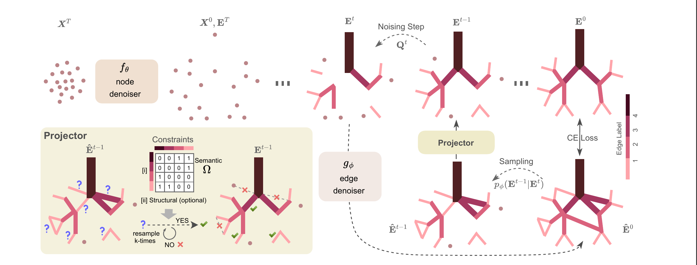
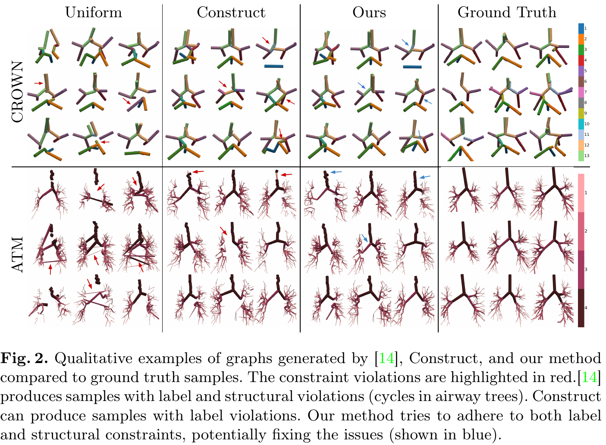

# Semantically Consistent Discrete Diffusion for 3D Biological Graph Generation

**Chinmay Prabhakar\***, Suprosanna Shit\*, Tamaz Amiranashvili, Hongwei Li, Bjoern Menze
MICCAI 2025



This repository contains the official code for our MICCAI 2025 paper, **“Semantically Consistent Discrete Diffusion for 3D Biological Graph Generation.”** 

We introduce a discrete diffusion framework that generates anatomically valid 3D vascular and airway graphs by (i) using a stochastic projection operator to correct structural errors, and (ii) adopting an edge-deletion noising scheme tailored to sparse biological networks.

Our method outperforms prior approaches on human Circle of Willis and lung airway datasets, improves downstream labeling accuracy, and serves as an effective off-the-shelf link predictor.

---

## 📖 TL;DR

> A diffusion-based method for generating anatomically valid 3D biological graphs using a stochastic projection operator to correct structural errors. Outperforms prior models on real human vascular and airway datasets, boosts downstream labeling accuracy, and is an effective off-the-shelf link predictor.

---

## 🚀 Quick Start

1. **Dataset download**

   ```bash
   # Download and unzip to your data directory:
   wget -O data.zip "https://syncandshare.lrz.de/getlink/fi66fbNwgXR7XsEnrTure7/"
   unzip data.zip -d /path/to/data
   ```

2. **Configure dataset paths**
   Edit the file paths in:

   * `Construct/datasets/cow_dataset.py`
   * `Construct/datasets/atm_dataset.py`
     to point at your local `/path/to/data`.

3. **Train node-coordinate diffusion**
   Each dataset requires its own node coordinate model:

   ```bash
   # Airway Trees (ATM)
   python -m src.bootstrap.node_coordinate_diffusion.atm_diff_nodes_with_3d_checks

   # Circle of Willis (CoW)
   python -m src.bootstrap.node_coordinate_diffusion.cow_diff_nodes_with_3d_checks
   ```

4. **Train discrete diffusion model**
   Adjust configs under `src/configs/` (choose between `atm` and `cow`):

   ```bash
   python -m src.Construct.main --config general_default.yaml
   ```

   * To train from scratch, ensure `test_only: null` in `general_default.yaml`.
   * To resume or sample from a checkpoint, set `test_only: /absolute/path/to/checkpoint.pt`.

5. **Sampling & Projection**
   In `general_default.yaml`, set:

   ```yaml
   projector: <option>
   ```

   Options:

   * `None`
     No projection.
   * `cow_proj_vanilla`
     Validates CoW topology only.
   * `cow_proj`
     Semantic resampling to fix CoW edges.
   * `atm_proj_vanilla`
     Validates ATM topology only.
   * `atm_vanilla`
     Our proposed resampling algorithm for ATM.


The constraints are defined in classes:

   * `TopCoWLineGraphCheck` (Circle of Willis)
   * `ATMLineGraphCheck` (Airway Trees)

in the `Construct.projector.projector_3d_utils.py` module.

6. **Compute statistics**
   After sampling, update paths in `stats_atm.py` and `stats_cow.py`, then run:

   ```bash
   python stats_atm.py
   python stats_cow.py
   ```

---



## 🤝 Acknowledgements

Our code builds upon [“Generative Modelling of Structurally Constrained Graphs” (Madeira et al.)](https://github.com/...), and we thank the authors for releasing their code and answering our queries.

---

## 📜 License

This project is released under the MIT License. See [LICENSE](LICENSE) for details.
